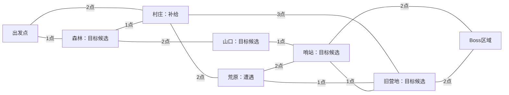

# 大世界网状地图系统规划

> 设计状态：已确认玩法规则与暂定实现建议。
> 本文用于后续实现；本次仅整理文档，不修改游戏逻辑。

## 1. 系统定位

大世界地图负责显示地区的地理位置、网状道路、旅行费用和探索信息。玩家沿道路选择目的地，进入对应的小地图进行移动、战斗、拾取和地区目标。

单局目标仍暂定约 15 分钟，以击败最终 Boss 或人物死亡结束。约 15 分钟是体验目标，不是硬倒计时。

路线规划的核心取舍：

- 优先完成关键目标，还是绕路获取补给和强化。
- 选择短路、绕路、已走过的返程道路，或尚未探索的新连接。
- 保留旅行预算，还是承担更高世界危险继续探索。
- 完成解锁条件后正常进入 Boss，或耗尽预算后挑战额外强化的 Boss。

## 2. 已确认规则

| 项目 | 规则 |
| --- | --- |
| 大地图形式 | 有地理位置的地区地图，通过道路连接。 |
| 道路结构 | 呈网络状，具有多方向连接、环路和替代路线。 |
| 旅行方式 | 沿道路前往相邻地区。 |
| 单局地区规模 | 6～8 个普通地区，另外有出发点和 Boss 区域。 |
| 小地图复用 | 同一局不允许同一个小地图场景出现多次；不同局可以使用同一批场景。 |
| 随机内容 | 地区位置和道路连接随机，保留合理的地理约束。 |
| 地图信息 | 逐步揭示附近地区和路线信息。 |
| 规划点 | 每局有限，不同道路消耗不同点数。 |
| 回头费用 | 回头减半；具体判定见第 6 节的暂定细则。 |
| 世界危险 | 与旅行预算分开计算，按地区进入、目标和事件推进，不按真实时间持续上涨。 |
| 危险效果 | 敌人数值增强，并出现更难的遭遇组合。 |
| 离开地区 | 到小地图入口或出口离开，允许撤退。 |
| 重访地区 | 同一局保留宝箱、怪物和事件状态。 |
| 正常进入 Boss | 从多个候选地区取得足够的印记或情报，完成解锁目标。 |
| 规划点耗尽 | 禁止前往其他普通地区；可以继续探索当前地区，到入口或出口后选择传送到 Boss。 |
| 未解锁时传送 | 预算耗尽后允许跳过解锁目标进入 Boss，但 Boss 获得额外强化。 |
| 特殊刷新道具 | 刷新当前地区的怪物、宝箱和事件；地形、世界地图位置、道路、剩余预算和世界危险保留。 |
| 单局结束 | 击败最终 Boss 或人物死亡。 |

## 3. 网状连接的具体含义

### 3.1 地区之间的关系

地区之间使用道路网络连接，玩家可以横向探索、绕行和回头。地图有多个闭环，并提供通往同一目标的替代路线。

基础方案采用双向道路，Boss 的进入资格由目标进度单独控制。

建议的生成约束：

- 整张道路图连通。
- 存在多个环路，使玩家有绕行和路线取舍。
- 多数普通地区拥有 2～3 个邻接地区，部分地区可有 4 个。
- 地区位置与道路具有合理的地理关系。
- Boss 区域可有多个道路入口；具体数量作为配置参数。
- 不设置固定楼层、固定行列或必须逐层推进的顺序。

道路密度属于暂定参数：太稀疏会减少替代路线，太密会削弱道路和地形成本的作用。

### 3.2 地图可见与地区可达

看见一个远处地区，不代表可以直接旅行过去。普通旅行依然沿相邻道路逐段进行。

预算耗尽后的 Boss 传送是特殊规则。

玩家点击不相邻的地区时，可以查看已知路线和成本；是否提供连续旅行功能留待后续决定。

### 3.3 视觉表现

实际界面按地理坐标绘制地区图标和道路：

- 当前地区、已访问地区、已揭示地区和未知地区使用不同表现。
- 已走过道路可以高亮，并显示本次返程是否享受半价。
- 道路交叉处必须明确是否连通；真正的连接点需要清楚标记。
- 优先控制线条交叉，必要时用桥、跨越或绕线区分道路。
- 出发前展示目的地、实际费用及旅行后的余额。

下图只是连接关系示例。地区名称、费用和目标分配均为候选，实际布局按地理位置绘制。

这个示例有 6 个普通地区。村庄、荒原、旧营地和哨站之间构成环路，森林与村庄之间也存在横向连接；Boss 可以通过不同道路抵达。

## 4. 单局流程

1. 据点整备并开始一局。
2. 生成本局地区、地理位置、网状道路、道路费用、目标分配和随机种子。
3. 展示起点附近的地区与可用道路。
4. 玩家确认旅行，扣除规划点，进入目的地小地图。
5. 玩家进行战斗、探索、拾取和目标事件。
6. 到入口或出口进入旅行界面，揭示新信息并选择下一段路线。
7. 取得足够印记后解锁正常进入 Boss 的资格。
8. 若预算耗尽，仍可探索当前地区；在出口只能选择 Boss 传送或继续留在当前地区。
9. 传送进入 Boss 时，根据世界危险和未完成的解锁目标设置强化。
10. 击败 Boss 或死亡，进行单局结算。

地图旅行界面是否暂停当前地区、人物限时增益在旅行界面是否计时，尚未确定。世界危险已经确定按事件推进，阅读地图不会因为真实时间流逝而自动增加危险。现有物品栏的“不暂停游戏”规则保持。

## 5. 随机生成规划

### 5.1 输入配置

- 可选地区资源池，每个资源对应一张独立的小地图场景。
- 普通地区数量范围。
- 地理类型与分布约束。
- 道路密度、环路和距离约束。
- 初始规划点。
- 候选目标数量与解锁所需印记数量。
- 地区遭遇和奖励配置。

### 5.2 生成顺序

1. 选择本局的普通地区，按场景身份去重。
2. 按地理规则安排位置，例如村庄靠近道路，森林形成片区。
3. 建立基础连通网络。
4. 添加横向连接和环路，形成多条可选路线。
5. 按道路长度和地形配置旅行费用。
6. 分配印记候选目标、普通事件和遭遇。
7. 检查目标和 Boss 的可达性。
8. 检查是否至少存在一条预算内取得足够印记并正常抵达 Boss 的路线。
9. 保存本局结果，后续查看地图或重访地区使用同一份数据。

额外探索可以使玩家错过预算内的正常路线，这是路线规划的代价。生成结果本身应提供可完成的正常路线。

### 5.3 场景数量约束

当前已有 `outdoor_map` 和 `new_map` 两张小地图。同一局各使用一次。

达到 6～8 个独立普通地区，需要另外制作 4～6 张普通地图，并准备 Boss 战斗区域。两张现有地图可以先用于验证旅行流程和状态保存；完整网状路线体验需要更多独立地区。

## 6. 旅行费用与预算

### 6.1 道路费用

每条道路拥有自己的基础费用。初版候选范围为 1～3 点，具体数值之后配置。

- 费用在本局生成后固定。
- 确认旅行前显示实际费用。
- 确认并成功进入目标地区时扣除一次。
- 取消旅行不扣费，场景加载失败不应损失预算。

### 6.2 回头半价

“回头减半”已确认。判定暂按以下规则设计：

- 首次沿 A → B 旅行，按道路原价收费。
- 此后沿同一道路 B → A 返回，按半价收费。
- 走一条新道路前往已访问地区，仍按新道路原价收费。
- 多次往返时具体如何识别返程，后续统一为明确的旅行历史规则。

原价 1、2、3 点的返程费用分别为 0.5、1、1.5 点。底层建议按半点整数单位保存，界面显示正常点数。

### 6.3 预算耗尽

- 最后一次旅行把规划点扣到 0，仍可以探索刚进入的地区。
- 到入口或出口后，不再允许前往其他普通地区，包括半价返程。
- 可以选择不再消耗规划点的 Boss 传送。
- 正常解锁条件未完成时，Boss 获得额外强化。

### 6.4 余额不足旅行的边界建议

**暂定建议，尚未作为用户已确认规则：**

例如还剩 0.5 点，但所有合法可选道路至少需要 1 点。此时建议提供与预算耗尽相同的 Boss 传送，提示“剩余预算不足以继续旅行”，并保留余额显示。

这条规则用于处理无法继续旅行的情况。

## 7. 迷雾与地图信息

- 开局揭示起点附近的地区和道路。
- 探索后逐步揭示附近的新地区。
- 已知可选道路在出发前展示准确费用。
- 显示已经取得的印记数量和 Boss 解锁要求。
- 地区目标、已探索状态、已完成状态和已刷新状态分别记录。
- 已确认的费用不会在玩家出发后重新随机。

Boss 的位置在何时揭示、远处未知地区显示轮廓还是完全隐藏，属于后续界面细则。

## 8. 世界危险与 Boss 强化

### 8.1 与规划点分开

规划点表示旅行预算，世界危险表示局势变化。两套数值独立保存和展示。

世界危险由事件推进，例如地区进入、完成目标和危险事件。以下细则为候选：

- 首次进入地区增加一次危险，重访不重复触发首次进入奖励或危险。
- 完成关键目标、触发危险事件时增加危险。
- 使用地区刷新道具可以增加少量危险。

具体增量、等级阈值和上限之后调整。

### 8.2 危险影响

按用户选择，危险同时影响：

- 敌人生命、伤害等数值。
- 敌人组合、精英比例和遭遇难度。
- 最终 Boss 的基础强度。

更难的遭遇可以提供更好的奖励，形成继续探索的风险收益取舍。

重访时已保存的怪物生命不会重新刷满。新生成或刷新后的遭遇可以根据当前危险等级配置。

### 8.3 关键目标

初版候选为：

- 世界中有 4 个可取得印记的候选目标。
- 完成任意 2 个后，解锁正常进入 Boss 的资格。
- 目标可以采用精英战、探索、取得情报或地区事件等形式。

4 个候选、需要 2 个是初版建议值，尚未确定为最终数值。

### 8.4 两种 Boss 强化来源

1. 世界危险带来的基础强化。
2. 预算耗尽传送时，跳过必要目标带来的额外强化。

进入前分别展示来源，让玩家看清本局选择的结果。具体强化可以包含数值、增援或招式变化，先由配置确定，随后根据 Boss 实际制作能力选择。

## 9. 地区状态保存与特殊刷新

### 9.1 本局全局状态

保存：

- 随机种子、地区位置、道路和固定费用。
- 当前地区与旅行历史。
- 剩余规划点、世界危险。
- 地图揭示状态。
- 印记、关键目标和 Boss 解锁状态。

### 9.2 每个地区的状态

分别保存：

- 宝箱是否开启及其奖励结果。
- 地面物品是否已拾取。
- 怪物是否死亡、剩余生命和位置。
- 事件与地区目标状态。
- 遭遇生成信息、刷新次数和地区随机种子。

宝箱、怪物和事件需要稳定 ID。再次进入地区时，按 ID 恢复对应状态。离开的地区暂不继续模拟战斗。

### 9.3 特殊刷新道具

刷新当前地区的怪物、宝箱和普通事件，并更新该地区的遭遇和奖励状态。

保留：

- 小地图地形、碰撞和大地图位置。
- 网状道路与道路费用。
- 剩余规划点和世界危险。
- 人物状态、物品栏和本局成长。
- 已计入本局的关键目标与印记进度。

关键目标每局只贡献一次进度。刷新后可以再次发生战斗，但同一个目标不重复发放解锁印记。

道具的获得方式、稀有度、额外危险代价，以及刷新时的安全生成处理，留待细化。

## 10. Godot 结构规划

沿用当前项目的资源驱动思路。

| 模块 | 职责 |
| --- | --- |
| `RegionConfig` 资源 | 地区 ID、名称、小地图场景、地理类型、图标、目标与遭遇配置。 |
| `WorldMapConfig` 资源 | 地区池、节点数量、初始预算、网状连接规则和解锁要求。 |
| `ThreatConfig` 资源 | 危险等级对应的数值倍率、遭遇权重和 Boss 强化。 |
| `RunWorldState` | 本局生成结果、预算、危险、探索信息、旅行历史、印记与地区状态。 |
| `WorldMap` 场景 | 地理底图、地区图标、网状道路、成本和迷雾显示。 |
| 统一旅行管理器 | 判断旅行资格与费用，保存当前地区，加载并恢复目标地区。 |
| 地区状态控制器 | 收集和恢复宝箱、怪物、物品及事件状态，处理地区刷新。 |
| 通用地区出口 | 在入口或出口打开旅行界面。 |

配置资源保持只读；预算、生命、事件完成与拾取状态保存在本局数据中。

人物实例或其完整运行数据在地图切换时保留，使生命、魔力、体力、背包和局内增益能够继续使用。

现有 `scripts/maps/scene_transition_area.gd` 会迁移人物并释放旧地图。后续需要由统一旅行管理器加入地区状态保存与恢复。

网状道路与小地图出口的映射属于后续实现细则。首版可以从现有入口或出口选择相邻地区；多个出口分别对应不同道路的方案可在需要时加入。

## 11. 建议实施顺序

### 阶段一：基础旅行与状态

使用现有两张地图完成：

- 通用入口和出口。
- 世界地图选择与旅行费用。
- 人物与物品栏保留。
- 宝箱、怪物和目标状态保存。
- 重访与半价返程。

这个阶段用于打通流程。

### 阶段二：独立地区与网状生成

- 补充普通地图，达到 6～8 个独立地区。
- 准备 Boss 区域。
- 地理位置与网状道路生成。
- 环路、横向连接和替代路线。
- 迷雾、道路费用与可达性检查。

### 阶段三：完整肉鸽规则

- 多个候选印记目标。
- 正常 Boss 解锁。
- 世界危险和遭遇升级。
- 预算耗尽后的传送与 Boss 额外强化。
- 特殊道具刷新。
- 单局结束与现有结算规则衔接。

## 12. 后续待确定事项

- 初始规划点、道路费用档位、返程判定的最终细则。
- 世界地图道路密度、地理约束和 Boss 道路入口数量。
- “余额不足任何合法旅行”是否等同预算耗尽。
- 危险增量、等级阈值、怪物与 Boss 强化幅度。
- 印记候选数量、所需数量和具体目标内容。
- Boss 位置揭示方式及地图迷雾表现。
- 世界旅行界面的暂停与限时增益计时。
- 特殊刷新道具的来源、代价和生成安全处理。

这些细则可以继续通过原型调整，不改变已经确定的网状旅行、地区记忆，以及 Boss 的正常进入与预算耗尽传送规则。
